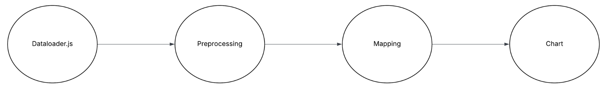
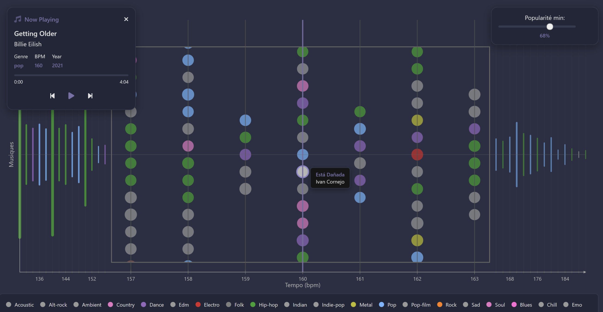
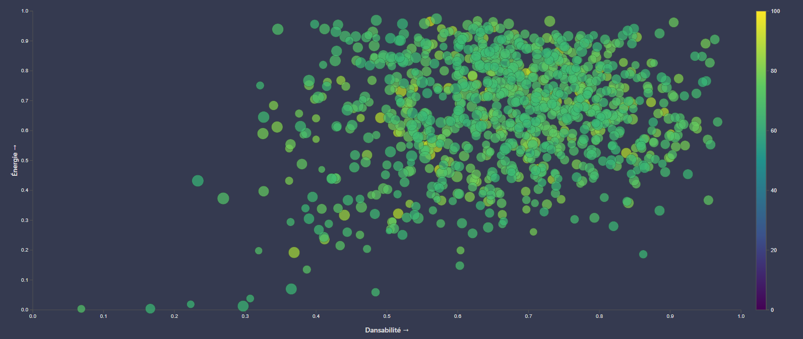
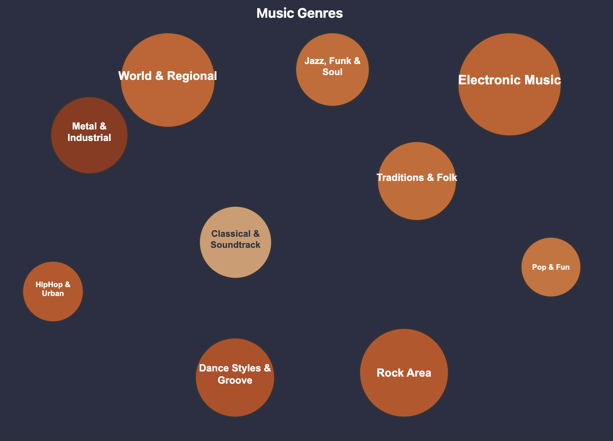

# 🎧 Spotimix – Information Visualisation Project

## Overview

**Spotimix** est un projet de visualisation de données réalisé dans le cadre du cours *Information Visualisation*.  
L’objectif est de concevoir plusieurs visualisations interactives à partir du dataset **Spotify 1 Million Tracks**, en utilisant **D3.js**.

Ce projet a pour utilisateurs cibles les **DJs et mixeurs**, chaque visualisation correspond à un **cas d’usage réel**, basé sur leurs besoins.

[Support de présentation](./images/Spotimix.pdf)

---

## Dataset

- **Nom :** [Spotify 1 Million Tracks](https://www.kaggle.com/datasets/amitanshjoshi/spotify-1million-tracks)  
- **Source :** Kaggle / API Spotify  
- **Taille :** environ 1 million de morceaux (2000–2023)  
- **Format :** CSV  
- **Description :** chaque ligne représente une chanson unique avec ses métadonnées et caractéristiques audio.

### Variables utilisées
| Colonne | Description |
|----------|-------------|
| `track_id` | Identifiant unique Spotify |
| `track_name` | Titre du morceau |
| `artist_name` | Nom de l’artiste |
| `year` | Année de sortie |
| `genre` | Genre musical |
| `popularity` | Score de popularité (0–100) |
| `tempo` | Vitesse en BPM |
| `danceability` | Facilité à danser |
| `energy` | Intensité et puissance sonore |
| `instrumentalness` | Niveau instrumental (absence de voix) |

---

## Utilisateurs cibles

Nous ciblons **DJs et mixeurs** souhaitant concevoir des sets cohérents. En utilisant Spotimix, ils pourront trier, filtrer et comparer les morceaux disponibles sur Spotify.

---

## Objectifs & tâches

1. Identifier **les artistes les plus populaires selon chaque période** afin de concevoir des sets cohérents et représentatifs de chaque époque
2. Trouver des **morceaux populaires au tempo similaire** pour des transitions fluides  
3. Filtrer les **titres à forte énergie et danceability** pour les moments dynamiques  
4. Dénicher des **morceaux instrumentaux** par style pour concevoir des mashups et overlays 

- Explorer la musique à **deux niveaux** :  
  - **Overview :** vue globale des tendances  
  - **Details :** exploration interactive de morceaux précis  
- Pouvoir filtrer par genre musical toutes les visualisations

---

## Prérequis pour lancer le projet

Pour lancer le projet, il vous faudra d'abord télécharger les fichiers suivants et les placer dans le répertoire `/assets` :
- Le dataset `spotify_data.csv` disponible sur [Kaggle](https://www.kaggle.com/datasets/amitanshjoshi/spotify-1million-tracks) 
- Les fichiers `music_genres_tree.json` et `indexByGenreSongs.json` disponibles sur [ce lien de téléchagement](https://mega.nz/folder/jYFFSLIL#UU76WlkeE22E33YD0S6tEw)

Spotimix est ensuite prêt à être utilisé !

---

## Visualization Pipeline

Notre architecture modulaire en pipeline offre une séparation claire des responsabilités :
- **DataLoader** : centralise et met en cache les données
- **Processors** : filtrent et agrègent selon la logique métier
- **Mappers** : transforment en variable visuelle (position, couleur, taille)
- **Charts** : gère le rendu D3.js

Cette approche garantit la réutilisabilité du code car on a un seul DataLoader pour 4 visualisations différentes.  Elle facilite aussi la maintenance car modifier les couleurs ne touche que le Mapper. Et enfin, notre système de cache permet d'améliorer les performances de chargement

---

## Visualization 1 – Heatmap (Darina)

### Objectif
Identifier **les artistes les plus populaires selon chaque période** 

### Données
- `artist_name`, `year`, `popularity`, `genre`
- Colonnes additionnelles :  
  - `popular_songs` : top 5 titres les plus populaires par artiste  
  - `rank` : niveau de popularité (0 à 4 selon le score)

### Fonctionnement
- **Axe X :** années (2000 à 2023 par défaut)
- **Axe Y :** les 30 artistes qui ont le plus de popularité cumulée entre chaque années
- **Couleur :** popularité maximale pour cet artiste en cette année (froid → chaud)  
- **Filtre :** par genre musical et par période (intervale d'années)
- **Overview + Details :**  
  - Vue globale : popularité des artistes de 2000 à 2023
  - Vue détaillée : top chansons d’un artiste sélectionné pour une année donnée

### Interactions
- Survol → popularité moyenne et nombre de pistes
- Clic → affichage du top 5 des chansons les plus populaires
- Filtrage dynamique par genre et par période

---

## Visualization 2 – Timeline (Gwendolyne)

### Objectif
Trouver des **morceaux populaires avec un tempo proche du son actuel**

### Données
- `tempo`, `genre`, `artist_name`, `track_name`, `year`, `popularity`

### Fonctionnement
- **Axe X :** tempo (BPM)  
- **Axe Y :** musiques (représentées par des points)  
- **Filtre :**  
  - par **genre musical**  
  - par **popularité minimale** (curseur ajustable)
- **Overview + Details :**
  - **Vue d’ensemble :** distribution globale des tempos (BPM), densité et genre le plus présent  
  - **Vue détaillée :** zone centrale avec les musiques au BPM proche (de -3 BPM à +3 BPM) de celui sélectionné  
  - **Détails sur la musique sélectionnée :** zone avec écrit le titre, le nom de l’artiste, l’année, le genre et le BPM de la musique sur laquelle l’utilisateur a cliqué  
  - **Survol d’une musique :** apparition du titre et du nom de l’artiste quand l’utilisateur survole le point représentant une musique

### Interactions
- Une ligne verticale = **un BPM**  
- Affichage des musiques dans la **fenêtre centrale** :
  - Points colorés selon le **genre** (couleurs détaillées en légende)  
  - Musiques avec un BPM entre **-3 et +3** autour du BPM actuel  
- **Sur les côtés :**  
  - Traits verticaux représentant les musiques sur un même BPM, qui est plus éloigné que +3 -3  
  - Possibilité de **cliquer** sur cette ligne pour la choisir en tant que nouveau BPM central, et donc voir les détails des musiques sur ce BPM dans la partie centrale  
  - Épaisseur et longueur = nombre de morceaux  
  - Couleur = genre dominant  
- **Clic sur un point :**
  - Affiche le détail du morceau dans un encart (titre, artiste, BPM, année, genre)  
  - Possibilité de lire un extrait audio dans le futur, nous ne l’avons pas réellement mis en place car c’est payant
- **Filtres :**  
  - Popularité : curseur ajustable (ex. min 87 %) pour n’afficher que les morceaux avec un score de popularité supérieur à 87 %  
  - Genre : voir seulement les musiques d’un genre spécifique

---

# Visualization 3 – Scatter Plot (Tom)

## Objectif
Identifier les morceaux les plus dansants et énergiques dans un style musical donné, afin d’aider les DJs à sélectionner les titres les plus adaptés à l’ambiance souhaitée.

## Données
`danceability`, `energy`, `popularity`, `track_name`, `artist_name`, `genre`, `track_id`

## Fonctionnement
- **Axe X :** Danceability (facilité à danser)
- **Axe Y :** Energy (intensité sonore)
- **Couleur :** Genre musical
- **Taille :** Popularité du morceau

### Overview + Details
- **Vue globale :** distribution des morceaux selon leur niveau d’énergie et de danseabilité
- **Vue détaillée :** sélection d’une zone via un *brush* (rectangle de sélection) pour explorer les morceaux similaires et obtenir des statistiques locales (moyenne de popularité, danceability, energy, etc.)

## Interactions
- **Brush interactif :** permet de sélectionner une zone du graphe pour obtenir un zoom sémantique indiquant la proportion moyenne de danceability et d’énergie des morceaux inclus.
- **Tooltip dynamique :** au survol d’un point, affiche le titre, artiste, popularité et genre.
- **Filtrage :** possibilité de filtrer les morceaux par genre musical ou par niveau minimal de popularité.
- **Clic sur un point :** permet de demander plus d’informations sur un morceau spécifique ou de le sélectionner pour une exploration ultérieure.

## Résumé
Cette visualisation permet une exploration fluide et intuitive du lien entre énergie, danseabilité et popularité.  
Le *brush* agit comme un outil d’analyse locale, révélant les tendances internes d’un sous-ensemble de morceaux, tandis que les interactions (survol, clic, filtres) offrent une expérience d’exploration progressive adaptée aux besoins d’un DJ.

---

## Visualization 4 – Arbre des genres musicaux (Antoine)

### Objectif
Trouver des titres par recherche de style et de sous style musicaux en utilisant de nombreux criteres de visualisation.
(danceability, energy, popularity, nb of sounds per style)

### Fonctionnement
- Chaque cercle = un **genre musical**  
- Taille du cercle = proportionelle au nb de titres du style ou de la moyenne de la popularité des sons du style (au choix) 
- Couleur du cercle = plus ou moins intense en focntion des autres criteres
- **Overview + Details :**
  - Vue globale : genres globaux
  - Zoom sur un genre → sous genre
  - Zoom sur un sous-genre -> titres musicaux
  - Click sur un titre -> détails du titre

### Interactions
- En plus des visualisations de genre : on peut filtrer les sons une fois dans la visualisation de titres musicaux
- Possibilité d'afficher au choix n titres (10, 20 ou 30)
- Possibilité d'afficher les n premiers titres triés par : danceability, energy, popularity 
- Croissant OU décroissant

---

## Conclusion

Ce projet illustre comment la **visualisation interactive** permet de mieux comprendre les tendances musicales et d’accompagner la création de sets DJ.  
Grâce à **D3.js**, chaque visualisation offre un niveau de contrôle et d’exploration adapté aux besoins des utilisateurs.  

Les filtres, la hiérarchie *overview + details* et les interactions intuitives (zoom, clic, survol) offrent une **expérience fluide et musicale**.  
Les DJs peuvent ainsi visualiser, comparer et sélectionner des morceaux de manière bien plus efficace que par simple écoute.

---

## Run
- Télécharger https://mega.nz/folder/jYFFSLIL#UU76WlkeE22E33YD0S6tEw et mettre a la racine
- Lancer un serveur sur index.html

## Team

**Groupe 1 – Spotify Visualization**  
- Gwendolyne Bouchard  
- Darina Chan  
- Antoine Maïstre  
- Tom Toupence  

---

## Technologies

- **D3.js** (visualisation interactive)  
- **HTML / CSS / JavaScript**  
- **Kaggle** (Données)

---

## Sources

- Dataset : [Kaggle – Spotify 1 Million Tracks](https://www.kaggle.com/datasets/amitanshjoshi/spotify-1million-tracks)  
- D3.js : [https://d3js.org/](https://d3js.org/)  
- ChatGPT/Claude : aide pour la compréhension et l’utilisation de D3.js
